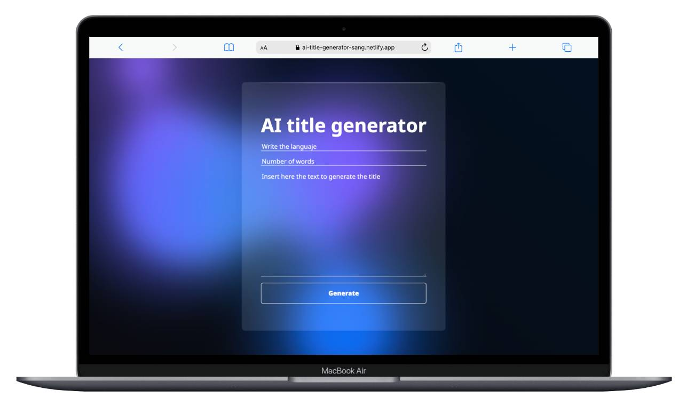

# AI Title Generator 🚀



**AI Title Generator** is a simple and powerful web application developed using **Vanilla JavaScript** and styled with **SASS**, leveraging the cutting-edge capabilities of **OpenAI's API**. This tool helps users create compelling and creative titles from any text input by choosing the language and the number of words for the title.

## Features ✨

- **User-friendly interface**: Simple and intuitive to use, with a futuristic design that embodies the essence of AI and technology.
- **Multi-language support**: Choose the language for your title. 🌍
- **Flexible title length**: Specify the desired number of words for the title. 🔢
- **Text input**: Type or paste the content you want to generate a title from. ✏️
- **Real-time processing**: Utilizes OpenAI's powerful language models to create unique titles. 🤖

## Installation 🔧

To get started with the project, follow these steps:

1. **Clone the repository**:
    ```bash
    git clone https://github.com/danisanguino/Ai-title-generator.git
    ```

2. **Navigate to the project directory**:
    ```bash
    cd title-generator
    ```

3. **Install the required dependencies** using npm:
    ```bash
    npm install
    ```

## Usage 💻

1. **Run the project locally**:
    ```bash
    npm run dev
    ```

2. **Open your web browser** and go to `http://localhost:5173` (or the specified port).

3. **Fill in the necessary fields**:
    - **Language**: Select the language in which you want the title. 🌐
    - **Number of words**: Specify the desired length of the title. 🔤
    - **Input text**: Type or paste the content you want to generate a title from. 📄

4. **Click the Generate button** to receive your AI-generated title. 🖱️

## Tech Stack 🛠️

- **Frontend**: Vanilla JavaScript, SASS (for styles)
- **AI Integration**: OpenAI API
- **Dependencies**:
    - npm packages (list packages in `package.json`)

## Contributing 🤝

If you would like to contribute to this project, please **fork the repository** and submit a **pull request** with your proposed changes.

## Acknowledgments 🙏

- **OpenAI**: For providing the powerful GPT-3 model.
- **Vanilla JavaScript & SASS**: For building a clean, modern, and fast frontend.

## Demo 🌟

Check out the live project [here](https://ai-title-generator-sang.netlify.app/).

Feel free to reach out with any questions or suggestions! 💬

---

**Note**: Make sure your `API_KEY` for OpenAI is correctly set up and accessible for the app to communicate with OpenAI's API.
